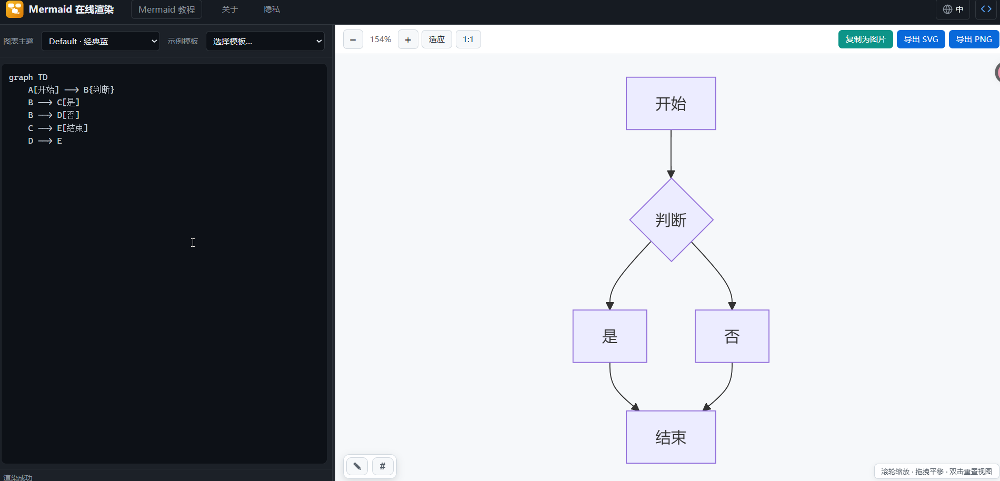

# Mermaid 在线渲染

左右分栏的 Mermaid 实时预览编辑器：左侧编写代码，右侧即时渲染，支持主题切换、缩放平移、导出 PNG / SVG。

在线预览：[https://mermaid.baimuxym.cn](https://mermaid.baimuxym.cn/)



## 功能

- 左右布局（约 1/3 编辑区 + 2/3 预览区），中间可拖动调整宽度
- 实时预览：流程图、时序图、甘特图、类图、状态图、ER 图、饼图、思维导图、时间线等
- 图表主题：default / neutral / dark / forest / base
- 预览区：滚轮缩放、拖拽平移、双击适应窗口
- 导出：SVG、PNG（2x 清晰度）

## 使用

**必须用下面命令启动**，不要直接双击打开 `index.html`，否则图标、脚本都会加载失败（路径 `/favicon.svg` 无效）。

```bash
# 进入项目目录（按你的实际路径修改）
cd "g:\project\AI\mermaid在线渲染"

# 首次使用：安装依赖
npm install

# 启动开发服务（默认 http://localhost:5173）
npm run dev
```

**重启开发服务**：在运行 `npm run dev` 的终端按 `Ctrl + C` 停止，再执行一次 `npm run dev`。

```bash
# 生产构建
npm run build

# 预览构建结果（需先 build）
npm run preview
```

浏览器访问：**http://localhost:5176/zh-CN/**  （以终端打印地址为准）。

生产构建：

```bash
npm run build
npm run preview
```

构建产物在 `dist/` 目录，可部署到任意静态站点。

## 快捷键

- `Ctrl/Cmd + Enter`：立即重新渲染
- `Tab`：插入两个空格缩进
